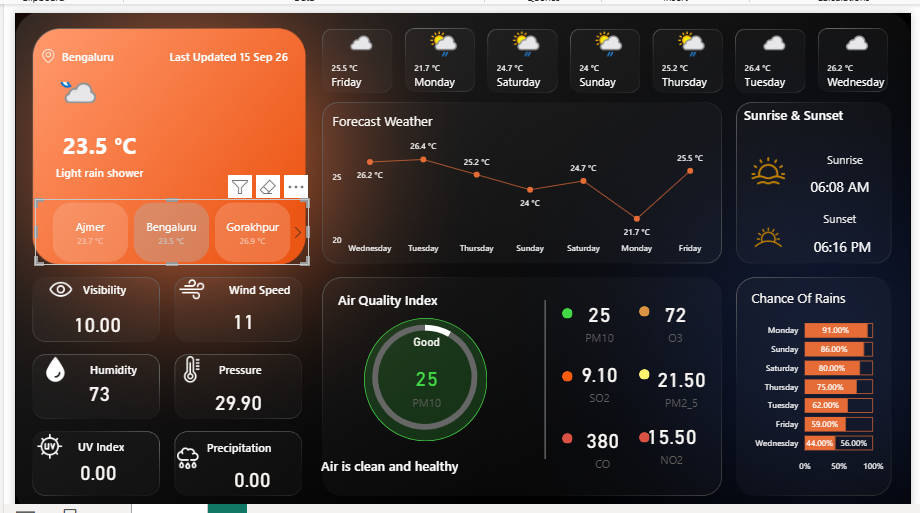

# Weather Analytics Dashboard – Power BI

## Project Overview

An interactive Weather Analytics Dashboard built using Microsoft Power BI.

The data is collected directly from a Weather API and is used to analyze current weather conditions, forecasts, air quality, and other key weather indicators.

## Dashboard Preview

## Key Features

- Current temperature and weather conditions
- Weather forecast
- Air Quality Index (AQI)
- PM10, PM2.5, SO2, NO2, CO and O3 analysis
- Humidity and wind speed
- Atmospheric pressure
- Visibility and UV Index
- Precipitation and chance of rain
- Sunrise and sunset timings
- Weather analysis across different locations

## Tools & Technologies

- Power BI
- Weather API
- Power Query
- DAX
- Data Visualization

## Project File

- `Weather_Analytics_Dashboard.pbix` – Power BI dashboard

## Author

**Madhu Singh**

Data Analyst | Power BI | SQL | Python | Excel
